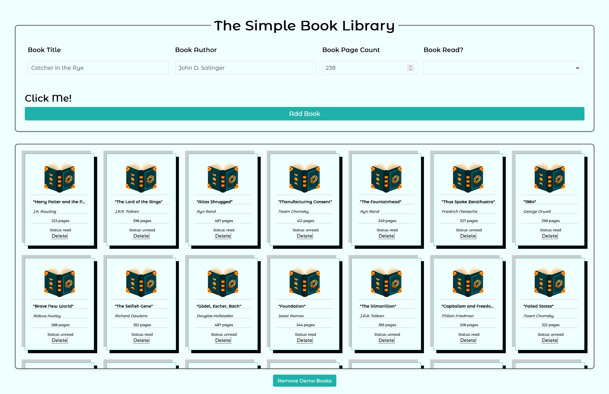

# The Simple Library

My first solo project from The Odin Project's JavaScript course. This simple library application helped me understand the basics of object-oriented programming, DOM manipulation, and event handling in JavaScript.

## Live Demo

➡️ [Try the Live Demo](https://myopicoracle.github.io/prototypes-library/)

## What It Does

- **Add Books**: Enter title, author, page count, and reading status
- **Display Books**: Shows each book as a card in a grid layout
- **Remove Books**: Delete books from the library
- **Visual Feedback**: Uses images and styling to make books look like actual cards

## How It Works

The project follows The Odin Project's requirements:

- **Book Constructor**: Creates book objects with properties (title, author, pages, read status)
- **Library Array**: Stores all book objects in a central array
- **DOM Display**: Renders each book as a card element on the page
- **Form Handling**: Uses `event.preventDefault()` to stop default form submission
- **Data-Attributes**: Associates DOM elements with their corresponding book objects

## Technical Details

- **Frontend**: HTML5, CSS3, Vanilla JavaScript (ES6+)
- **Classes**: Uses ES6 classes with inheritance for book creation and display
- **DOM Manipulation**: Creates and appends elements dynamically
- **CSS Grid**: Responsive grid layout for book cards
- **Event Handling**: Form submission and button interactions

## What I Learned

This was my introduction to several core JavaScript concepts:

- Constructor functions and object creation
- Prototypal inheritance and class structure
- DOM manipulation and event handling
- Form processing and validation
- Separating data logic from display logic
- Basic responsive design with CSS Grid

Looking back at this code, I can see areas that could be improved, but this project taught me fundamental concepts that I still use today. It was simple enough to complete quickly but complex enough to teach important programming patterns.

## Project Context

This was Project #1 in The Odin Project's JavaScript curriculum. The assignment focused on:

- Creating book objects using constructor functions
- Storing objects in an array with unique IDs
- Displaying data separately from the data structure
- Implementing CRUD operations
- Understanding event handling and form processing

Even though it's one of the simplest projects I've built, it was memorable because it was my first experience putting together all the JavaScript concepts I had learned into a working application.